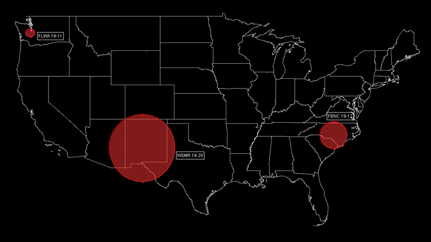

# GPS Jamming Demo

Uses latest Earthscope SDK to retrieve observation and ephemeris data to detect GPS jamming using the C/No method.

<figure>
  
  <figcaption>Areas where the military is conducting GPS interference on March 1. Image generated with TARGETS courtesy of MITRE.</figcaption>
</figure>